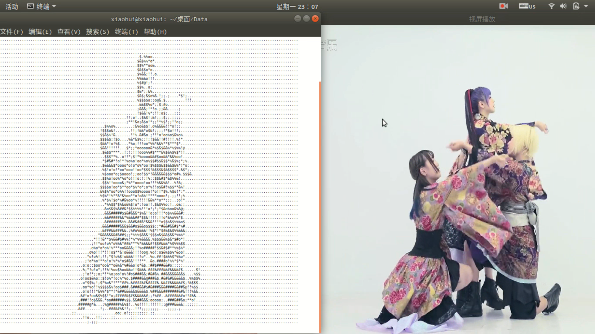

## 基于opencv将视频转化为字符串
先上一个效果图吧

## code
- python版本
- java版本
## 原理

我们要将视频转化为字符画,那么就需要获取画面的每一帧,也就是每一张图片,然后将图片进行转化,变成字符串,然后进行打印。
[博客](https://blog.weno.cc/2018/09/08/%E5%9F%BA%E4%BA%8Eopencv%E5%B0%86%E8%A7%86%E9%A2%91%E8%BD%AC%E5%8C%96%E4%B8%BA%E5%AD%97%E7%AC%A6%E4%B8%B2Java%E7%89%88/#more "")

